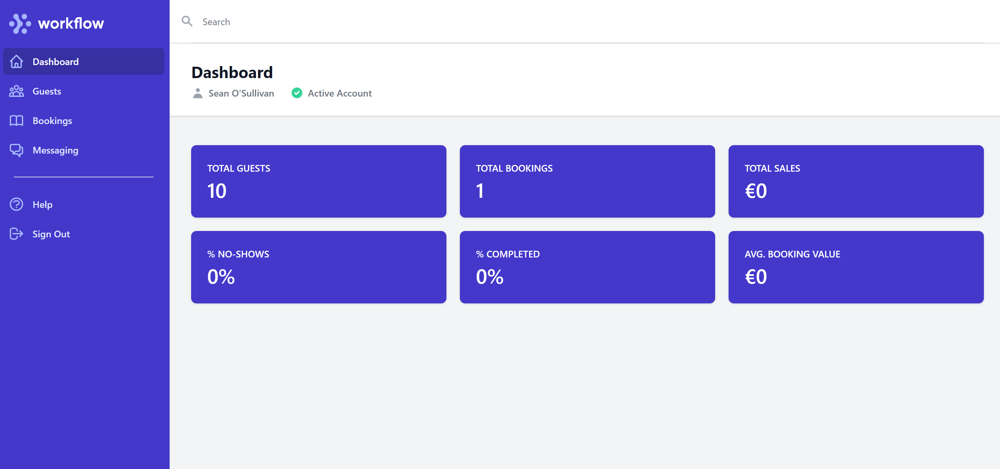

# restdos-final

# RestDos
[Click To See Live Site](https://restdos-final.herokuapp.com/)

RestDos is an app and website designed to help owners of small restaurants manage their guests, bookings and messaging. It acts as a complete CRM that empowers the restaurant team to deliver perfect service each and every time. 

[](https://restdos-final.herokuapp.com/)

## CONTENTS
1. [User Stories](#user-stories)
1. [Design and UX](#design-and-ux)
    - Mockups
1. [Website Pages and Features](#website-pages-and-features)
    - Common Features
    - Hompage
    - Solutions
    - Contact
    - Pricing
    - Blog
    - Live Demo
    - Privacy
    - Terms
    - Newsletter Signup
    - Signup
    - Confirm Email
    - Confirmed confirm Email
    - Login

1. [App Pages and Features](#app-pages-and-features)
    - Common Features
    - Dashboard
    - Guests
        - Add Guest
        - Guest Detail
        - Delete Guest
    - Bookings
        - Add Bookings
        - Edit Booking
        - Delete Booking
    - Messaging
        - Compose Message
        - Pay & Send Message
    - Help
    - Logout
1. [Database Schema](#database-schema)
1. [Testing](#testing)
1. [Bug and Issues Log](#bug-and-issues-log)
1. [Potential Future Features](#potential-future-features)
1. [Deployment](#deployment)
    - [GitHub Pages](#github-pages)
    - [Forking the GitHub Repository](#forking-the-github-repository)
    - [Making a Local Clone](#making-a-local-clone)
    - [Tailwind](#Tailwind)
    - [Heroku](#Heroku)
    - [AWS](#AWS)
1. [Credits & Attribution](#credits-and-attributions)

***

## Project Stories

### User Stories
As a user I want to ...
- Signup
This is implemented through the pricing > signup flow with allauth
- CRUD Guests
Users can create, update, view and delete guests
- CRUD Bookings
Users can create, update, view and delete bookings
- Send marketing messages to my guests
Users can create and send a campaign to all their guests

### Business Stories
As the website owner I want to ...
- Drive signups
The web pages do this.
- Generate Leads
This is achieved through social links in the footer of the website as well as the newsletter signup at the bottom of every page.
- To receive money from signups & marketing campaigns
The signup flow includes a stripe payment model as does the messaging app where users can send marketing campaigns
- Be able to manage queries from users and Be able to help users with queries or changes to their accounts
The contact from sends messages to the site owner

***

## Design and UX


### Website Mockups
The below image links to figma design file of website side the application.
[](https://www.figma.com/file/qAy7XQsKaKW6ekC1ssgalx/MS4?node-id=0%3A1)

The below image links to figma design file of app side the application.
[](https://www.figma.com/file/qAy7XQsKaKW6ekC1ssgalx/MS4?node-id=6%3A1470)

***

## Website Pages and Features

### Common Features
You can sign up to the newsletter from every page on the website. This sends an email to the site owner and shows a success message to the website user. This is a great way for the site owner to generate leads for potential future revenue. 

### Homepage
This is an eye grabbing page that is focused on getting the website user to click through to the pricing page. It focuses on value delivery and problem solving for the user.


### Solutions
This breaks down the main features of the application for users who want a bit more detail before proceeding to signing up and paying.

### Contact
This form lets website users who have additional questions to send them to the site owner. It is another way to generate leads.

### Pricing
The pricing page focuses on simple, easy to understand pricing and quick CTA to help drive website users to signing up to the service. It also lists top features as well as an FAQ for any of those last minute doubts. The pricing shown changes based on how many users the system has. As user numbers increase so does the price.

### Blog
The blog contains resources from across the industry that may be of interest to website visitors. It's main purpose is to show the knowledge and industry connections the application has. This is important when dealing with industries like restaurants as a common perception is that tech doesn't know anything about the service industry.

### Privacy
This contains a privacy policy as required under EU law.

### Terms
This contains the terms of use and service for the website and application as required under EU law. It also serves as the contract for when people signup so that the business is covered.

### Signup
The signup flow contains a number of stages as outlined below:
1. Email check - this is just to ensure the user isn't already a user before we take payment
1. payment - this is to confirm what they are signing up to and take payment from them. It also confirms the terms and conditions of the contract.
1. Signup - This is the actual signup form that will create the users account. Ideally this would be part of the payment form but I was not able to customize allauth in such a way. Streamlining the signup process here would be an ideal #potential-future-improvement as it would increase the conversion rate for signups. 
1. Email verification - the signup is sent an email to confirm their email
1. Email confirmation - When they click on the link in their email it gets them to confirm it. 
1. Signin - They can now signin to their account via the login page and now have their own account.

## App Pages and Features

### Common Features
1. Login is required on all pages. Users accessing the urls directly will be directed to the login page for authentication.
1. There is a global guest search at the top of each page. Users can search for guests by name, mobile or email. They will see different things based on the results of their search:
- No Results: Empty guests page with notification that their search returned no results
- 1 Result: The guest detail page for the guest.
- 2+ Results: The guest page filtered to show these guests as well as a notification to say how many guests were returned.

### Dashboard
This page shows some key statistics about the salons performance on RestDos. It shows figures for their entire time with RestDos.
- Total Guests: The count of guest profiles not deleted.
- Total Bookings: The total number of bookings not deleted.
- Total Sales: The sum of booking value for bookings marked completed.
- % No-Shows: The number of bookings with status no-show that are not deleted divided by the total number of bookings that are not deleted.
- % Completed: The number of bookings with status completed that are not deleted divided by the total number of bookings that are not deleted.
- Avg. Booking Value: Total Sales divided by the number of bookings with status completed that are not deleted.

### Guests
This page shows a table of guests information ordered by first name and last name. There is currently no pagination on this page. It is a #potential-future-improvement as large databases will create significant load times if either pagination or lazy loading is not implemented. 

From this page the users can add a new guest to their system or access an existing guest to see their complete profile.

#### Add Guest
When adding a guest the personal information section is the only section avaiable. There is validation on all fields here however it should be noted that duplicate emails, names and mobile number are allowed. This is due to the fact that many bookings by different guests would be under the same details. The easiest example is a family where they are bookign in for each other with the same detais. The restaurant needs the name on the booking but it doesn't really matter if the email is the same as another guest profile. 

At the moment the mobile is a char field as I didn't get time to add validation that would account for all variables in mobile phone numbers. The onus is on the user at the moment to ensure the mobile is valid. #potential-future-improvement

Once saved they will be taken to the guest detail page for the newly created guest. 

#### Guest Detail
On this page the user can add a booking for the guest or delete the guest. It should be noted that while for the user the guest is deleted it is not actually deleted from the database. The main reason for this is that mistakes and disgruntled employees will often result in deleted profiles. Not removing them from the database means support are able to make these profiles active again. if the application moved into the POS space it would also be a requirement for that information not to be deleted to comply with financial regulations. 

The guest rating in this section is a rating that the restaurant can give to the guest. While this may seem strange it is a feature that allows the restaurant to identify VIP guests that they want to give special treatment to or as a way of marking which type of table the guest should be given when booking in. Delivering service in this way greatly increases the revenue of the restaurant.

There are 3 notes sections in the guest detail page that allow the user to add important notes about the guest. There is also a stats section that shows some interesting stats that restaurant owners will want to know about their guests. And finally there is a booking section that contains all the bookings for the guest that have not been deleted. 

### Bookings
This is where the user will see their booking list. They can filter the list by booking status and date. The filters always default to all bookings for status and the current date in the date field. Bookings are ordered by time. 

The user can access the guest detail page for each booking by clicking on the guest column and they can edit the booking by clicking on the edit column on the right hand side for each booking. To add a booking they must do this through the guest profile.

#### Add & Edit Bookings
Users add bookings through the guest profile and edit them through the guest profile or on the bookings page. They must fill in all fields and the guest rating, people and booking value must all be above 0.

The guest rating in this form would ideally be submitted by the guest themselves after the service. Normally off the back of receiving an SMS or Email with a review link. Unfortunately implementing this was outside of the scope of this project but is certainly a #potential-future-improvement.

When editing a booking they can delete the booking as well. It should be noted that while for the user the booking is deleted it is not actually deleted from the database. The main reason for this is that mistakes and disgruntled employees will often result in deleted bookings. Not removing them from the database means support are able to make these profiles active again. if the application moved into the POS space it would also be a requirement for that information not to be deleted to comply with financial regulations. 

### Messaging
Here the user can send a sms message to all of their guests. It consists of 2 screens. The first is a compose screen that informs them of how many messages they will be sending per guest. The second is a preview & send screen where more details about the campaing are displayed to the user so they can make an informed decision on sending the campaign or not. Payment is taken immediately for the campaign. 

### Help
The help page details what they can do in the software and is the resource a new user would use after signing up to the service. 

### Logout
Users can logout here and a confirm page is shown to them prior to actually logging them out.

***

## Database Schema

### Guests
Field Name | Type | Notes
---|---|---
User | ForeignKey | Links to the user profile so we know who can access the guest
first_name | CharField
last_name | CharField
mobile | CharField
email | EmailField
dob | DateField | Date of Birth
sms_marketing | BooleanField
sms_transactional | BooleanField | Not used for any checks at the moment. Useful in the future for transactional messaging
rating | IntegerField
service_notes | TextField
kitchen_notes | TextField
allergen_notes | TextField
deleted | BooleanField | Stops the data appearing to the user
last_updated | DateField


### Bookings
Field Name | Type | Notes
---|---|---
user | foreignkey | connects to user model
guest| foreignkey | connects the booking to a guest
date | date
time | time
people | positiveinteger
rating | integer
status | charfield | links to a textchoices class in the same model
deleted | boolean
booking_value | positiveinteger

### Signup
Field Name | Type | Notes
---|---|---
user | onetoone | links to the allauth django user model
first_name | charfield
last_name | charfield
email | emailfield

***

## Testing

All testing is present in testing tables at [TESTING.md](TESTING.md)

***

## Bugs and Issues Log

All bugs and issues that occured during build are marked FIX in the commit log if they aren't present in the testing tables mentioned above. The bugs that occured during this project where on the most part oversights during initial feature development caused by my lack of time to complete the project (something entirely my own fauly of course). 

***

## Potential Future Features
1. Reports
1. Transactional Messaging to allow reviews to be made by guests after the service.
1. Users so the restaurant can control access to various things rather than having just 1 login.
1. Booking Widget so that guests can create bookings directly into the system based on the restaurants settings.
1. Improved signup flow with less steps. Ideally all in 1 or at most 2 pages.
1. Ability for users to un-delete guests and bookings themselves to remove the need to contact support (turning it into an archived function rather than deleted).
1. Add mobile validation that accounts for all types of mobiles


***

## Deployment

### GitHub Pages

The project was deployed to GitHub Pages using the following steps...

1. Log in to GitHub and locate the [GitHub Repository](https://github.com/sreninc/financial-freedom)
2. At the top of the Repository (not top of page), locate the "Settings" Button on the menu.
    - Alternatively Click [Here](https://raw.githubusercontent.com/) for a GIF demonstrating the process starting from Step 2.
3. Scroll down the Settings page until you locate the "GitHub Pages" Section.
4. Under "Source", click the dropdown called "None" and select "Master Branch".
5. The page will automatically refresh.
6. Scroll back down through the page to locate the now published site [link](https://sreninc.github.io/financial-freedom/) in the "GitHub Pages" section.

### Forking the GitHub Repository

By forking the GitHub Repository we make a copy of the original repository on our GitHub account to view and/or make changes without affecting the original repository by using the following steps...

1. Log in to GitHub and locate the [GitHub Repository](https://github.com/sreninc/financial-dreedom)
2. At the top of the Repository (not top of page) just above the "Settings" Button on the menu, locate the "Fork" Button.
3. You should now have a copy of the original repository in your GitHub account.

### Making a Local Clone

1. Log in to GitHub and locate the [GitHub Repository](https://github.com/sreninc/financial-freedom)
2. Under the repository name, click the "Code" button and a dropdown menu will appear.
3. To clone the repository using HTTPS, under "Clone with HTTPS", copy the link.
4. Open Git Bash
5. Change the current working directory to the location where you want the cloned directory to be made.
6. Type `git clone`, and then paste the URL you copied in Step 3.

```
$ git clone https://github.com/YOUR-USERNAME/YOUR-REPOSITORY
```

7. Press Enter. Your local clone will be created.

```
$ git clone https://github.com/YOUR-USERNAME/YOUR-REPOSITORY
> Cloning into `CI-Clone`...
> remote: Counting objects: 10, done.
> remote: Compressing objects: 100% (8/8), done.
> remove: Total 10 (delta 1), reused 10 (delta 1)
> Unpacking objects: 100% (10/10), done.
```

Click [Here](https://help.github.com/en/github/creating-cloning-and-archiving-repositories/cloning-a-repository#cloning-a-repository-to-github-desktop) to retrieve pictures for some of the buttons and more detailed explanations of the above process.

8. Tailwind
9. Heroku
10. AWS S3

***

## Credits and Attributions
1. Tailwind
1. Stackoverflow
1. Heroicons
1. Djangoproject